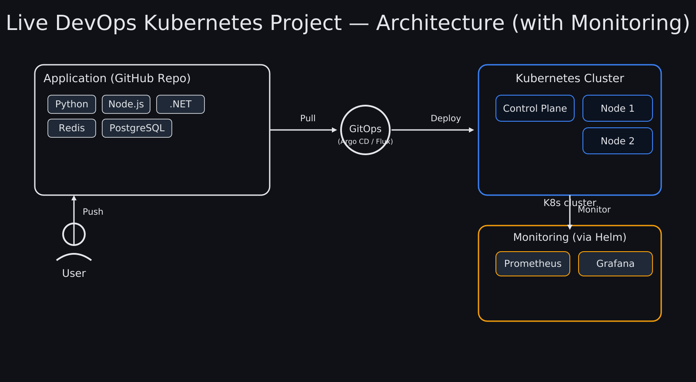

# k8s-kind-argo-observability-stack

This repository contains the **architecture diagram** and supporting materials for a complete DevOps project using Kubernetes, GitOps, and Monitoring tools.

## 📌 Overview
The architecture demonstrates how applications are deployed, managed, and monitored in a modern DevOps setup:

1. **Infrastructure Setup**
   - Launch an AWS EC2 instance.
   - Install Docker and Kind.
   - Create a Kubernetes cluster using Kind.
   - Install and access `kubectl`.
   - Set up the Kubernetes Dashboard.

2. **Application Deployment**
   - **User** pushes code changes to a GitHub repository.
   - **GitOps controller** (Argo CD or Flux) pulls the changes.
   - GitOps then deploys workloads into the **Kubernetes cluster**.
   - The **Kubernetes cluster** runs workloads across Control Plane and Worker Nodes.

3. **GitOps Management**
   - Install and configure **Argo CD**.
   - Connect and manage your Kubernetes cluster with Argo CD.

4. **Monitoring & Observability**
   - Install monitoring stack via Helm charts.
   - **Prometheus** scrapes metrics from the cluster.
   - **Grafana** visualizes dashboards for observability.

## 🏗️ Components

### Application Layer
- Python
- Node.js
- .NET
- Redis
- PostgreSQL

### GitOps
- Argo CD or Flux

### Kubernetes Cluster
- Control Plane
- Worker Nodes

### Monitoring
- Prometheus
- Grafana

## 📂 Files in This Repo
 `k8s-kind-argo-observability-stack.png` → High-quality PNG image

## 📊 Diagram

## 🔮 Future Enhancements
- Add CI/CD pipeline integration (GitHub Actions, Jenkins, or GitLab CI).
- Extend monitoring with Alertmanager.
- Add service mesh (Istio/Linkerd) for traffic management.

---
✍️ Maintained by **Zeeshan Ullah Khan**

